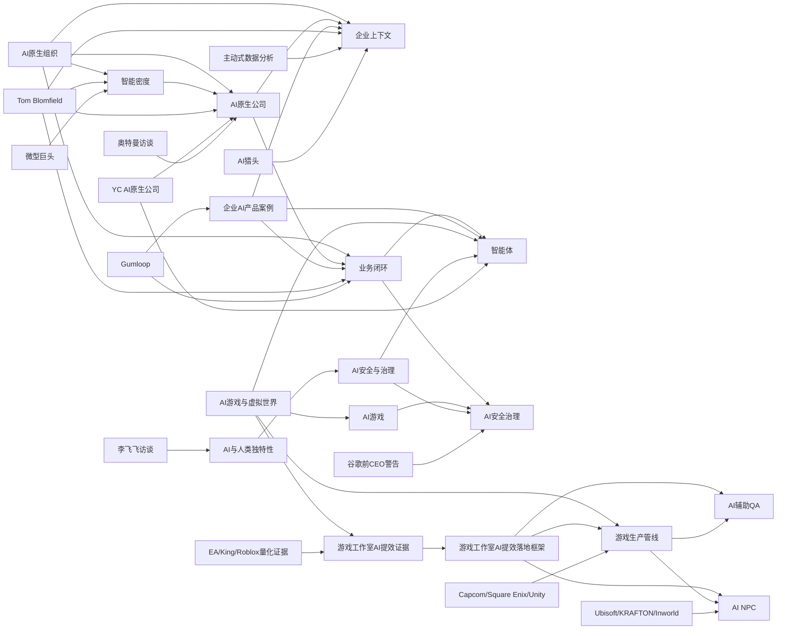

# 知识图谱

> 自动整理初版 | 2026-06-03 | 先覆盖核心主题、实体和第一批素材摘要

## 查看方式

- Obsidian、GitHub、Typora 或 VS Code Markdown Preview Enhanced 均可渲染上面的 Mermaid 图。
- 后续可以按 `.wiki-schema.md` 的 graph 工作流生成交互式 `knowledge-graph.html`。

## 相关页面

- [[index]]
- [[wiki/overview]]
- [[AI原生组织]]
- [[AI原生公司]]
- [[企业上下文]]
- [[业务闭环]]
- [[智能密度]]
- [[游戏工作室 AI 提效证据]]
- [[游戏工作室AI提效落地框架]]
- [[AI辅助QA]]
- [[AI NPC]]
