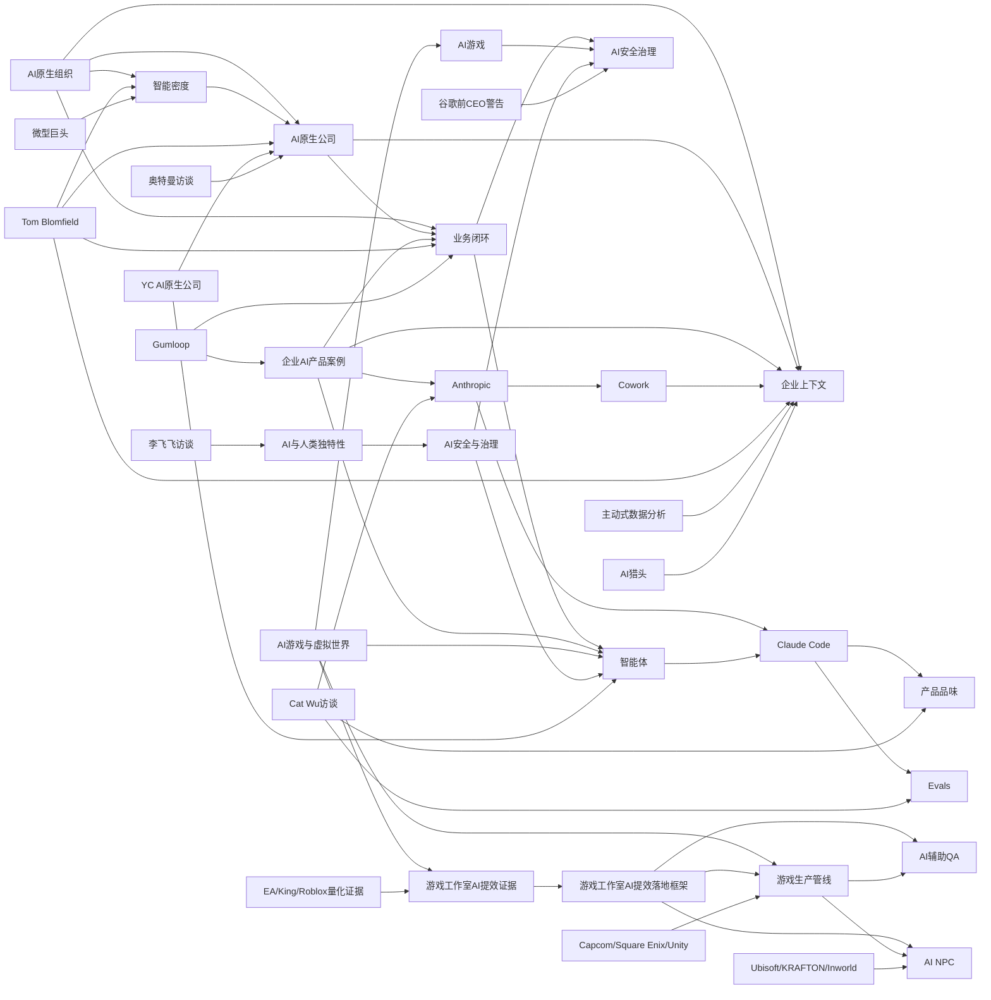

# 知识图谱

> 自动整理初版 | 2026-06-03 | 先覆盖核心主题、实体和第一批素材摘要

## 查看方式

- Obsidian、GitHub、Typora 或 VS Code Markdown Preview Enhanced 均可渲染上面的 Mermaid 图。
- 后续可以按 `.wiki-schema.md` 的 graph 工作流生成交互式 `knowledge-graph.html`。

## 相关页面

- [[index]]
- [[wiki/overview]]
- [[AI原生组织]]
- [[AI原生公司]]
- [[企业上下文]]
- [[业务闭环]]
- [[智能密度]]
- [[游戏工作室 AI 提效证据]]
- [[游戏工作室AI提效落地框架]]
- [[AI辅助QA]]
- [[AI NPC]]
- [[Anthropic产品负责人：AI时代，产品经理最值钱的能力是品味]]
- [[Anthropic]]
- [[Claude Code]]
- [[Cowork]]
- [[产品品味]]
- [[Evals]]

## 2026-06-07 新增长程 Agent Harness 子图

- [[Anthropic团队：如何构建运行 数小时的Agent]] --> [[长程智能体]]
- [[Anthropic团队：如何构建运行 数小时的Agent]] --> [[Agent Harness]]
- [[Agent Harness]] --> [[生成器-评估器架构]]
- [[Agent Harness]] --> [[文件系统共享状态]]
- [[生成器-评估器架构]] --> [[Evals]]
- [[生成器-评估器架构]] --> [[AI辅助QA]]
- [[文件系统共享状态]] --> [[企业上下文]]
- [[Claude Code]] --> [[Agent Harness]]
- [[长程智能体]] --> [[智能体]]
- [[Anthropic]] --> [[Claude Code]]

## 2026-06-07 新增后敏捷 AI 研发子图

- [[麦肯锡：AI 时代，旧的敏捷开发方式正在拖累个人效率]] --> [[后敏捷操作模型]]
- [[麦肯锡：AI 时代，旧的敏捷开发方式正在拖累个人效率]] --> [[AI研发提效]]
- [[后敏捷操作模型]] --> [[Spec-driven development]]
- [[后敏捷操作模型]] --> [[AI原生工作流]]
- [[后敏捷操作模型]] --> [[技术债]]
- [[AI原生工作流]] --> [[智能体]]
- [[AI原生工作流]] --> [[企业上下文]]
- [[Spec-driven development]] --> [[企业上下文]]
- [[技术债]] --> [[Agent Harness]]
- [[Agent Harness]] --> [[后敏捷操作模型]]

## 2026-06-30 新增 AI 辅助游戏开发子图

- [[AI辅助游戏开发]] --> [[Roblox Studio]]
- [[AI辅助游戏开发]] --> [[Claude Code]]
- [[AI辅助游戏开发]] --> [[Model Context Protocol]]
- [[AI游戏与虚拟世界]] --> [[AI辅助游戏开发]]
- [[不用再学代码了！零基础AI全自动做Roblox游戏教程]] --> [[Claude Code]]
- [[不用再学代码了！零基础AI全自动做Roblox游戏教程]] --> [[DeepSeek]]
- [[不用再学代码了！零基础AI全自动做Roblox游戏教程]] --> [[Script Sync]]
- [[Roblox Studio 接入 Claude MCP：自动生成游戏内 GUI 系统]] --> [[Model Context Protocol]]
- [[【中配】用AI制作罗布乐思爆款游戏 其实很简单 - tef]] --> [[Rojo]]
- [[【中配】用AI制作罗布乐思爆款游戏 其实很简单 - tef]] --> [[Claude Code]]
- [[竟然已经可以游玩了？Roblox AI渲染游戏【Roblox新闻】]] --> [[AI原生游戏]]
- [[Script Sync]] --> [[Roblox Studio]]
- [[Rojo]] --> [[Roblox Studio]]
- [[Model Context Protocol]] --> [[Claude Code]]
- [[AI辅助游戏开发]] --> [[游戏工作室AI提效落地框架]]

## 2026-07-01 新增 游戏商业化与虚拟经济子图（话题 A）

- [[游戏商业化与虚拟经济]] --> [[游戏经济系统]]
- [[游戏商业化与虚拟经济]] --> [[游戏付费设计]]
- [[游戏商业化与虚拟经济]] --> [[游戏长线运营]]
- [[游戏商业化与虚拟经济]] --> [[IP衍生变现]]
- [[游戏商业化与虚拟经济]] --> [[创作者经济]]
- [[游戏经济系统]] --> [[游戏付费设计]]
- [[游戏付费设计]] --> [[AARRR模型]]
- [[游戏长线运营]] --> [[IP衍生变现]]
- [[游戏长线运营]] --> [[创作者经济]]
- [[王者荣耀]] --> [[天美工作室群]]
- [[天美工作室群]] --> [[游戏商业化与虚拟经济]]
- [[王者荣耀日赚20亿的商业秘密（海盗Talk）]] --> [[王者荣耀]]
- [[王者荣耀日赚20亿的商业秘密（海盗Talk）]] --> [[AARRR模型]]
- [[游戏设计师为什么总是搞不好经济系统（火兰杂谈）]] --> [[游戏经济系统]]
- [[乐高的三大商业战略（小Lin说）]] --> [[乐高]]
- [[乐高]] --> [[IP衍生变现]]
- [[乐高]] --> [[创作者经济]]
- [[乐高]] --> [[跨界商业案例]]

## 2026-07-01 新增 游戏+AI 布局子图（话题 B）

- [[AI游戏与虚拟世界]] --> [[游戏AI提效]]
- [[AI游戏与虚拟世界]] --> [[AI无法取代的核心竞争力]]
- [[游戏AI提效]] --> [[游戏生产管线]]
- [[游戏AI提效]] --> [[AI NPC]]
- [[游戏AI提效]] --> [[天美工作室群]]
- [[GDC2026观察：AI时代中国游戏在什么位置（退役编辑雨上）]] --> [[游戏AI提效]]
- [[米哈游LPM大型表演模型（退役编辑雨上）]] --> [[AI NPC]]
- [[给NPC加AI真能让游戏更好玩吗（插眼GameWard）]] --> [[AI NPC]]
- [[给NPC加AI真能让游戏更好玩吗（插眼GameWard）]] --> [[AI无法取代的核心竞争力]]
- [[AI无法取代的核心竞争力]] --> [[AI与人类独特性]]
- [[AI无法取代的核心竞争力]] --> [[产品品味]]

## 2026-07-01 新增 深访频道·世界模型与Agent子图

- [[世界模型]] --> [[基础模型]]
- [[世界模型]] --> [[具身智能]]
- [[世界模型的终局之路：因果世界模型（十字路口×黄碧薇）]] --> [[世界模型]]
- [[谢赛宁7小时访谈：世界模型与AMI Labs（张小珺商业访谈录）]] --> [[世界模型]]
- [[米哈游LPM大型表演模型（退役编辑雨上）]] --> [[世界模型]]
- [[OpenClaw]] --> [[Agent Harness]]
- [[20个问题搞懂OpenClaw：Agent范式的爆红（十字路口）]] --> [[OpenClaw]]
- [[罗福莉谈AI范式巨变与OpenClaw（张小珺商业访谈录）]] --> [[OpenClaw]]
- [[Agent Harness：模型是脑Harness是手（十字路口×MiniMax×Hermes）]] --> [[Agent Harness]]
- [[杨植麟谈K2与Agentic LLM（张小珺商业访谈录）]] --> [[基础模型]]
- [[逐段讲解Kimi K2报告：系统工程的力量（张小珺商业访谈录）]] --> [[基础模型]]
- [[端侧模型]] --> [[具身智能]]
- [[阳萌谈第三类公司与端侧模型（张小珺商业访谈录）]] --> [[端侧模型]]

## 2026-07-01 新增 深访频道·组织与游戏子图

- [[FDE]] --> [[AI原生组织]]
- [[FDE：AI时代的新岗位与旧分工松动（十字路口×Rolling AI）]] --> [[FDE]]
- [[2026 AI游戏全景扫描：四层图景与共识缺口（十字路口×405游局）]] --> [[AI无法取代的核心竞争力]]
- [[前原神主创聊AI游戏创业（十字路口×恶少）]] --> [[AI游戏与虚拟世界]]
- [[十字路口]] --> [[AI人物访谈]]
- [[张小珺商业访谈录]] --> [[AI人物访谈]]
